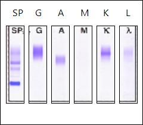

# Immunofixation Electrophoresis (IFE) Image Recognition based on Deep Learning
This repository provide source code for IFE image recognition in the following paper:

* H. Hu et al. "Expert-level Immunofixation Electrophoresis (IFE) Image Recognition based on Explainable and Generalizable Deep Learning". Submited to Clinical Chemistry.


# Image and preprocess
The images in this study are from two different systems that have different image styles (see `data/data_a` and `data/data_b`, respectively). We preprocess the images to make them have the same arrangement and size. The following figures shows images before and after preprocessing.

 

To play with a demo for image preprocessing, run the following command:

```
python preprocess.py
```

# Demo for inference
To use the pretrained model for inference, download the checkpoints from Google Drive and save them to ``ckpts``. Run the following script:

```
python demo_inference.py
```

By defualt, it uses the image `data/data_a/20200824_1012358442.jpg` from group `a` as an example. You can set different image names, such as an image from group `b` by editing line 72:

```
img_name, group  ="data/data_b/9971568DTouch64.jpg", "b" 
```