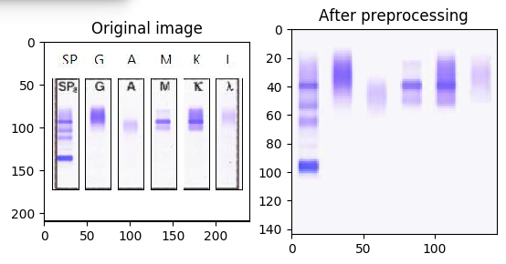
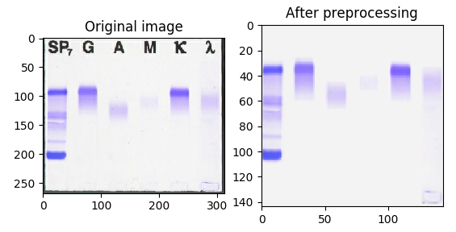

# Immunofixation Electrophoresis (IFE) Image Recognition based on Deep Learning
This repository provides source code for IFE image recognition in the following paper:

* Honghua Hu, Wei Xu et al. "Expert-level Immunofixation Electrophoresis (IFE) Image Recognition based on Explainable and Generalizable Deep Learning". Clinical Chemistry, 69, no. 2 (2023): 130-139.

BibTeX entry:

    @article{Hu2023IFE,
    author = {Honghua Hu and Wei Xu and Ting Jiang and Yuheng Cheng and Xiaoyan Tao and Wenna Liu and Meiling Jian and Kang Li and Guotai Wang},
    title = {Expert-Level Immunofixation Electrophoresis Image Recognition based on Explainable and Generalizable Deep Learning},
    year = {2023},
    url = {https://doi.org/10.1093/clinchem/hvac190},
    journal = {Clinical Chemistry},
    volume = {69},
    issue = {2},
    pages = {130-139},
    }
    
# Requirements
* [Pytorch][torch_link] version >=1.9.0
* [PyMIC][pymic_link], a Pytorch-based toolkit for medical image computing. Version 0.2.5 is required. Install it by `pip install PYMIC==0.2.5`.
* Som basic python packages such as Numpy, Pandas, scipy.
* See `requirements.txt` for more details

# Image and preprocess
The images in this study are from two different systems that have different image styles (see `data/data_a` and `data/data_b`, respectively). We preprocess the images to make them have the same arrangement and size. The following figures show images before and after preprocessing.

 


To play with a demo for image preprocessing, run the following command:

```
python preprocess.py
```

# Demo for inference
To use the pretrained model for inference, download the checkpoints from [Google Drive][model_link] and save them to `ckpts`. Note that in the oringal paper, each of the three networks (VGG16, ResNet18 and MobileNetv2) has five checkpoints based on 5-fold cross validation. Due to the Google Drive space limit, we only upload one checkpoint for each network for model ensemble. 
Run the following script for inference:

```
python demo_inference.py
```

By defualt, it uses the image `data/data_a/20200824_1012358442.jpg` from group `a` as an example. You can set different image names, such as an image from group `b` by editing line 72:

```
img_name, group  ="data/data_b/9971568DTouch64.jpg", "b" 
```

[torch_link]:https://pytorch.org
[pymic_link]:https://github.com/HiLab-git/PyMIC
[model_link]:https://drive.google.com/drive/folders/1w6e5omz_CdiOyGSViUOtWedM9kXGVr7J?usp=sharing
